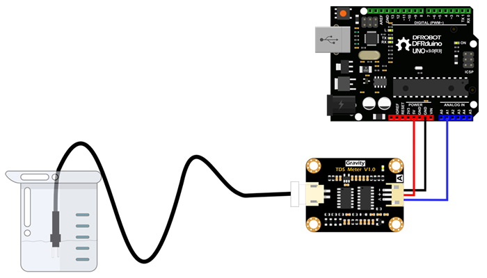

Este é um tutorial para a implementação destes sensores com o Arduino:

### Sensor de Turbidez Arduino ST100; 
### Sensor de PH Arduino PH-4502C; 
### Sensor de Condutividade da Água TDS Meter V1.0; 
### Sensor de Temperatura com NTC 10K à Prova D'Água - MF58;

Neste arquivo explicaremos como fazer a ligação de cada sensor com o arduino. Os outros arquivos neste rpositório são exemplos de código comentado que explicam como programar esses sensores.

# Sensor de Turbidez Arduino ST100

Fonte: https://www.usinainfo.com.br/blog/sensor-de-turbidez-projeto-de-leitura-da-qualidade-da-agua/

A imagem mostra como o sensor é conectado na placa conversora e quais são as portas a serem conectadas no arduino.
Power "-" (G) é o ground;
Power "+" (V) é o 5v;
Analog output (A) é a porta para leitura do arduino, no código de exemplo está conectada no A0;
As portas Level output (D) e Power "-" (4, no lado do sensor) não serão usadas nesse tutorial.

# Sensor de PH Arduino PH-4502C

Fonte: https://www.usinainfo.com.br/blog/sensor-de-ph-arduino-como-calibrar-e-configurar/

A imagem mostra como o sensor é conectado na placa conversora e quais são as portas a serem conectadas no arduino.

Ground para a placa é conectado no ground do arduino;
5V DC é conectado no 5v do arduino;
A saída analógica do PH (Po) é conectada na entrada A0 do arduino;
As outras portas não serão usadas nesse tutorial.

Este tutorial apresenta dois códigos para o sensor de PH, o primeiro serve para calibrar o sensor, ele mostra a voltagem lida, que deve ser 2,5v, enquanto o valor lido for diferente de 2,5v deve-se girar o parafuso de calibração de leitura até que o valor lido seja 2,5v.

Para o segundo código, a variável valor_calibracao deve ser ajustada em uma substÂncia de PH conhecida para garantir a calibração do sensor.

# Sensor de Condutividade da Água TDS Meter V1.0

Fonte: https://www.usinainfo.com.br/blog/projeto-medidor-de-tds-arduino-para-condutividade-da-agua/

A imagem mostra como o sensor é conectado na placa conversora e quais são as portas a serem conectadas no arduino.
### OBS: Diferente do exemplo, testes que fizemos com este sensor não funcionaram bem com 5v, use 3.3v, outras configurações são iguais.
As entradas e saídas da placa conversora do sensor unsam um plug único para os três cabos que serão usados no arduino, cabe usar um adaptador para fazer essa conexão.
A saída do sensor deverá ser conectada na porta A0 do arduino.

# Sensor de Temperatura com NTC 10K à Prova D'Água - MF58

Fonte: https://blogmasterwalkershop.com.br/arduino/como-usar-com-arduino-sensor-de-temperatura-ntc-10k-3950-prova-dagua-do-tipo-sonda

Este sensor é um thermistor simples e conta apenas com uma entrada para o 5V e outra para o ground. A entrada para o ground também é onde será feita a Leitura do sensor. Essa entrada deverá ser conectada em uma protoboard, conecta diretamente com a porta A0 do arduino e depois indiretamente no ground, passando por um resistor de 10k ohms.
Este trabalho usa a biblioteca Thermistor, que está inclusa neste repositório, caso necessária.